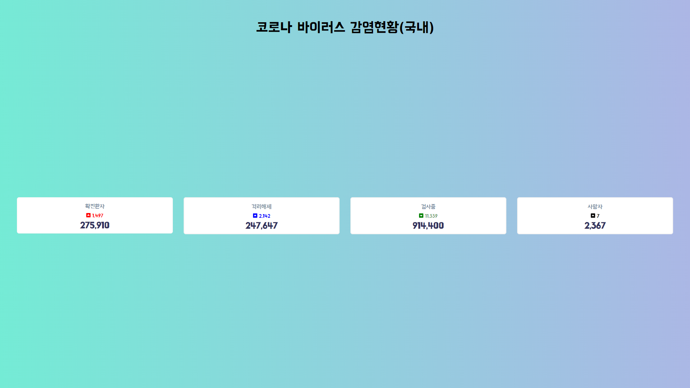
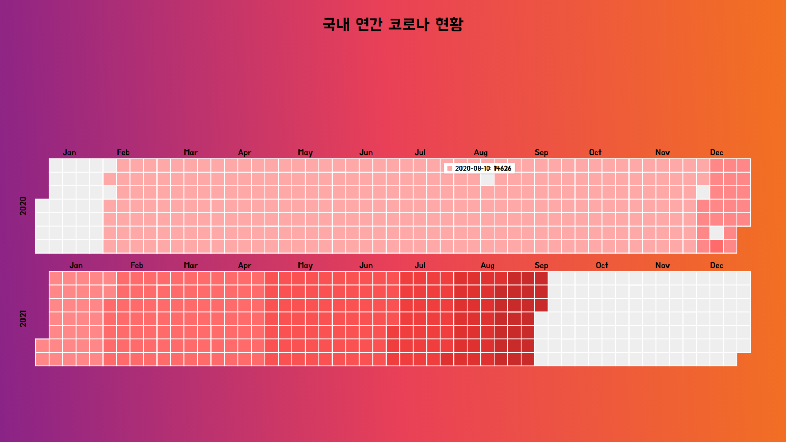
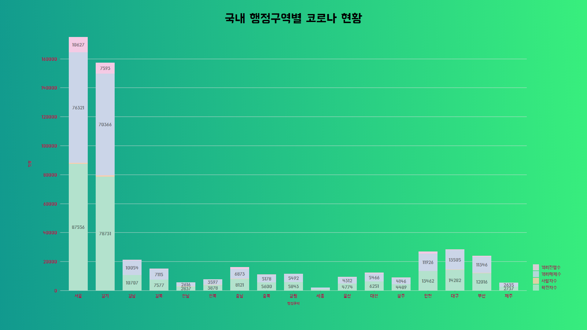
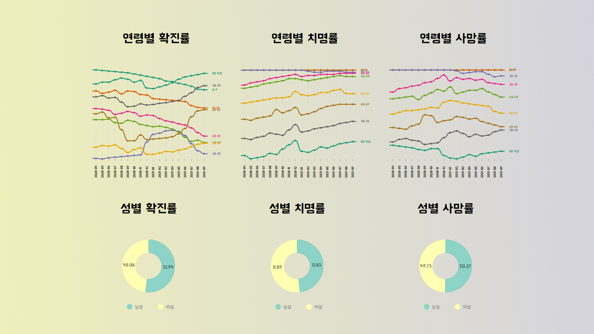
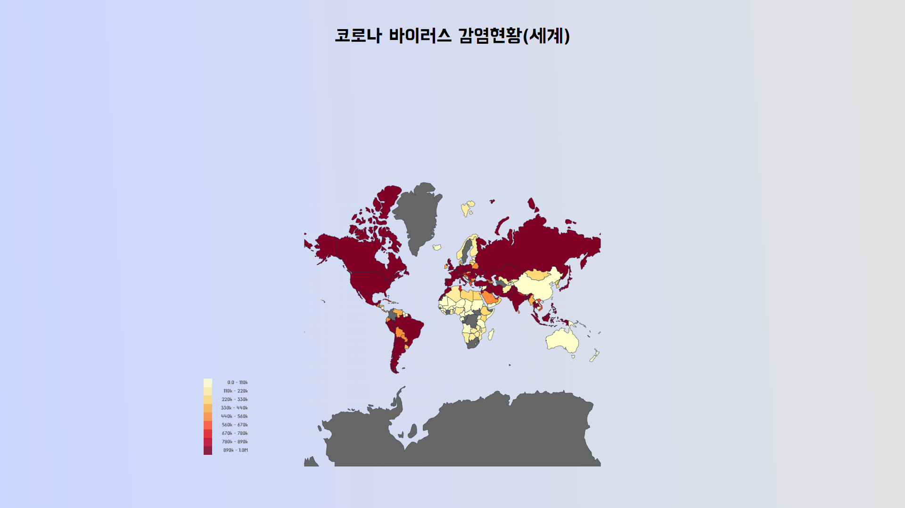

# covid19-stats
## Description
- 리액트로 구현한 코로나 집계 사이트
- [공공 데이터](https://www.data.go.kr/data/) OPEN API 사용
- 사용 API 목록  
    1. 공공데이터활용지원센터_보건복지부 코로나19 감염 현황
    2. 공공데이터활용지원센터_보건복지부 코로나19 시·도발생 현황
    3. 공공데이터활용지원센터_보건복지부 코로나19 연령별·성별감염 현황
    4. 공공데이터활용지원센터_보건복지부 코로나19 해외발생 현황

- 데이터 시각화
    1. react-chartjs-2
    2. [nivo](https://nivo.rocks/)

- Full Page Scroll
    1. [react-fullpage](https://github.com/alvarotrigo/react-fullpage)

- CORS 문제 해결을 위해 client와 server로 나누어서 개발
- 1920x1080 해상도

---
## Environment
```
SERVER_HOST = 127.0.0.1
SERVER_PORT = 5000
CLIENT_HOST = 127.0.0.1
CLIENT_PORT = 3000
COVID19SERVICEKEY = 공공 데이터 open api key 발급
```

---
## Prerequisite
```
1. open server
cd server
npm install
npm start

2. open client
cd client
npm install
npm start
```

---
## Usage




